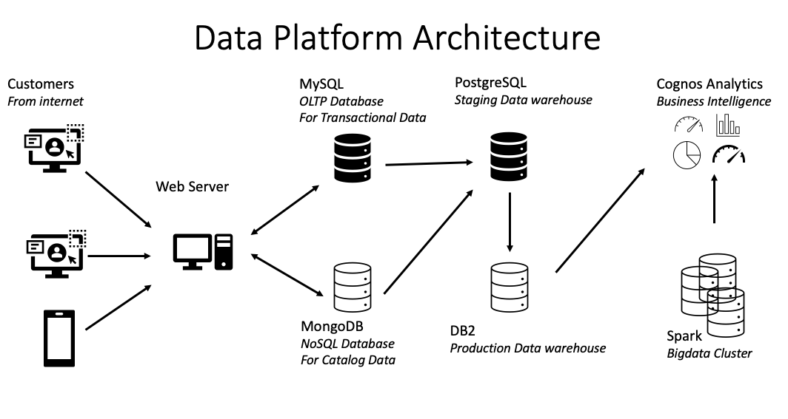

# Data Engineering Capstone Project

> Author: Gabriel Pedrosa
> 
> Date: April 15, 2023
> 
> [IBM Data Engineering Professional Certificate](https://www.coursera.org/professional-certificates/ibm-data-engineer)
> 
> [Certification](https://www.credly.com/badges/f7013162-ee8d-437f-a742-8c4fdaccd76b)
> 
> Final project to achieve the IBM Data Engineering Professional Certificate

## Introduction

The objective of this project is to develop a data platform for an e-commerce company called SoftCart, in which an end-to-end data pipeline will be developed, including the design and implementation of data architectures (RDBMS, NoSQL and Data Warehouse) , ETL processes, BI dashboards and Machine Learning models. All projects are independent of each other.

## Company Scenario

SoftCart's online presence is primarily through its website, which customers access using a variety of devices like laptops, mobiles and tablets.

All the catalog data of the products is stored in the MongoDB NoSQL server.

All the transactional data like inventory and sales are stored in the MySQL database server.

SoftCart's webserver is driven entirely by these two databases.

Data is periodically extracted from these two databases and put into the staging data warehouse running on PostgreSQL.

Production data warehouse is on the cloud instance of IBM DB2 server.

BI teams connect to the IBM DB2 for operational dashboard creation. IBM Cognos Analytics is used to create dashboards.

SoftCart uses Hadoop cluster as it big data platform where all the data collected for analytics purposes.

Spark is used to analyse the data on the Hadoop cluster.

To move data between OLTP, NoSQL and the dataware house ETL pipelines are used and these run on Apache Airflow.

## Data Platform Architecture

## Tools and Technologies

- OLTP database - MySQL

- NoSql database - MongoDB

- Production Data warehouse – DB2 on Cloud

- Staging - Data warehouse – PostgreSQL

- Business Intelligence Dashboard - IBM Cognos Analytics

- Data Pipelines - Apache Airflow

- Machine Learning - Apache Spark

## Directories

| Directory | Description                     |
| --------- | ------------------------------- |
| `sql/`    | SQL files                       |
| `steps/`  | Development steps documentation |
| `imgs/`   | Images repository               |
| `src/`    | Code repository                 |

## Environment Development Steps

1. [Design and Implement OLTP Database](./steps/oltp_database.md)

2. [Import data into MongoDB](./steps/nosql_database.md)

3. [Design, Setup & Report Data Warehouse](./steps/data_warehouse.md)

4. [Data Analytics](./steps/analytics_with_cognos.md)

5. [ETL and Data Pipelines](./steps/etl_and_data_pipelines.md)

6. [Spark ML](./src/Practise_Lab_-_Model_saving_and_loading%20(1).ipynb)
