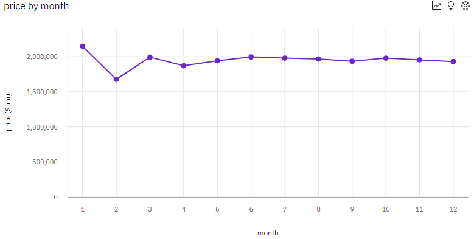
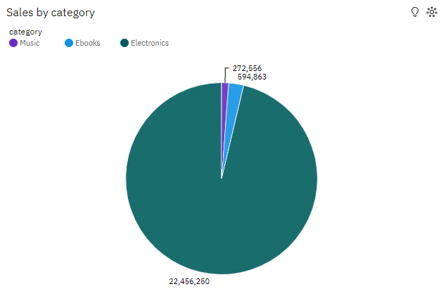
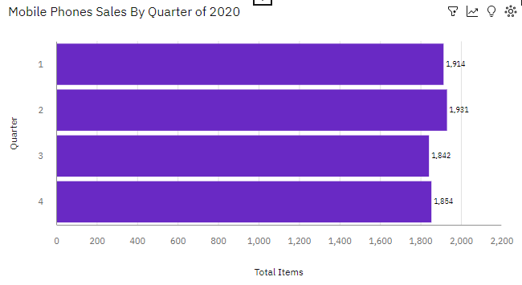

# Data Analytics with IBM Cognos Analytics

## Connect Cognos Analytics to table `sales_history` from DB2 database

## Create a line chart

Line chart of month wise total sales for the year 2020.

## Create a pie chart

Pie chart of category wise total sales.

## Create a bar chart

Bar chart of Quarterly sales of mobile phones.

