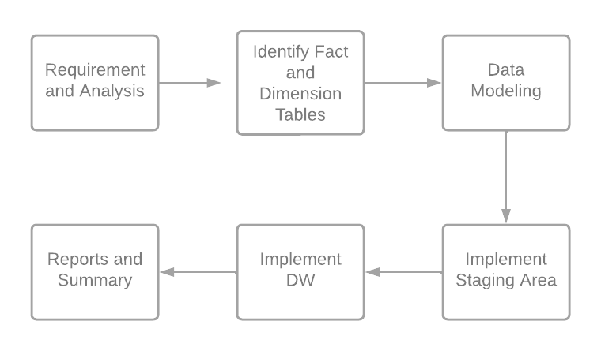
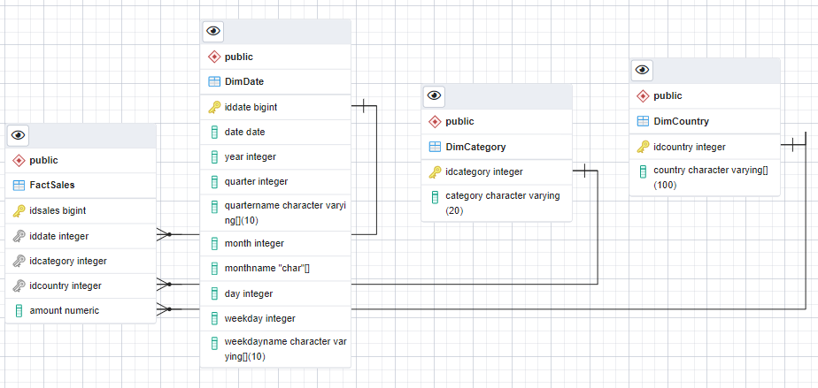
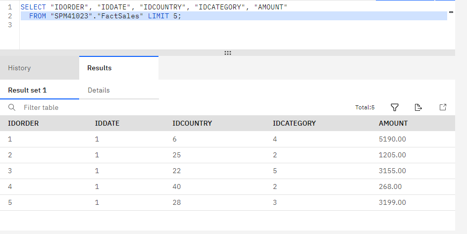
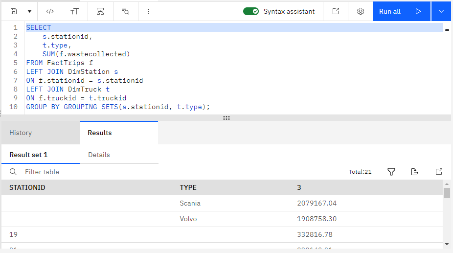
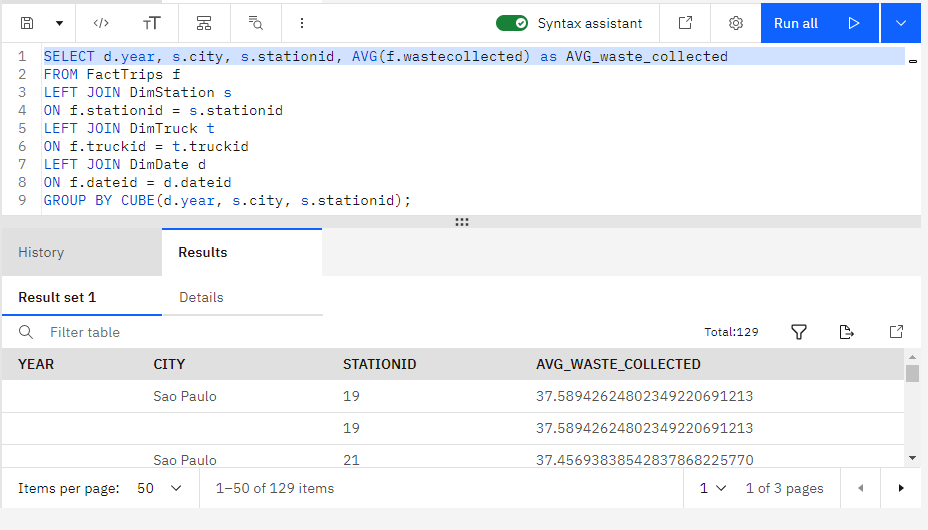

# Data Warehouse Design, Setup and Reporting

## Development steps



## Company Requirements

The company would like to create a data warehouse so that it can create reports like:

- total sales per year per country
- total sales per month per category
- total sales per quarter per country
- total sales per category per country

## Identify Fact and Dimension Tables

- Fact Table
  
  - FactSales

- Dimension Tables 
  
  - DimDate (year, month, quarter...)
  
  - DimCountry (country)
  
  - DimCategory (category)

## Dimensional Modeling



## Technologies

| Technology             | Description               |
| ---------------------- | ------------------------- |
| PostgreSQL             | Staging area              |
| IBM Cloud DB2 Database | Data Warehouse Production |

## Implement Staging Area

```sql
-- This script was generated by a beta version of the ERD tool in pgAdmin 4.
-- Please log an issue at https://redmine.postgresql.org/projects/pgadmin4/issues/new if you find any bugs, including reproduction steps.

CREATE SCHEMA IF NOT EXISTS staging;

CREATE TABLE staging."DimDate"
(
    iddate bigint NOT NULL,
    date date NOT NULL,
    year integer NOT NULL,
    quarter integer NOT NULL,
    quartername char(2) NOT NULL,
    month integer NOT NULL,
    monthname varchar(20) NOT NULL,
    day integer NOT NULL,
    weekday integer NOT NULL,
    weekdayname varchar(20) NOT NULL,
    PRIMARY KEY (iddate)
);

CREATE TABLE staging."DimCategory"
(
    idcategory integer NOT NULL,
    categoryname varchar(20) NOT NULL,
    PRIMARY KEY (idcategory)
);

CREATE TABLE staging."DimItem"
(
    iditem integer NOT NULL,
    itemname varchar(255) NOT NULL,
    price decimal(10,2) NOT NULL,
    PRIMARY KEY (iditem)
);

CREATE TABLE staging."DimCountry"
(
    idcountry integer NOT NULL,
    country varchar(100) NOT NULL,
    PRIMARY KEY (idcountry)
);

CREATE TABLE staging."FactSales"
(
    idsales bigint NOT NULL,
    iddate integer NOT NULL,
    iditem integer NOT NULL,
    idcategory integer NOT NULL,
    idcountry integer NOT NULL,
    PRIMARY KEY (idsales)
);

ALTER TABLE staging."FactSales"
    ADD FOREIGN KEY (iddate)
    REFERENCES staging."DimDate" (iddate);


ALTER TABLE staging."FactSales"
    ADD FOREIGN KEY (iditem)
    REFERENCES staging."DimItem" (iditem);


ALTER TABLE staging."FactSales"
    ADD FOREIGN KEY (idcategory)
    REFERENCES staging."DimCategory" (idcategory);


ALTER TABLE staging."FactSales"
    ADD FOREIGN KEY (idcountry)
    REFERENCES staging."DimCountry" (idcountry);
```

## Load data into Data Warehouse

1. Create an DB2 instance

2. Open the DB2 panel

3. Go to Manage > Data > Load  data

4. Populate your Data Warehouse with a full load

## Fact Sales Populated

 

## Reports and Summary

### Grouping sets

Grouping sets query using the columns country, category, totalsales.

```sql
select co.country, ca.categoryname, sum(f.amount) as totalsales
from "SPM41023"."FactSales" f
left join "SPM41023"."DimCountry" co
on f.idcountry = co.idcountry
left join "SPM41023"."DimCategory" ca
on f.idcategory = ca.idcategory
group by grouping sets(co.country,ca.categoryname)
order by co.country, ca.categoryname
```

### 

### Rollup

Rollup query using the columns year, country, and totalsales.

```sql
select co.country, d.year, sum(f.amount) as totalsales
from "SPM41023"."FactSales" f
left join "SPM41023"."DimCountry" co
on f.idcountry = co.idcountry
left join "SPM41023"."DimDate" d
on f.iddate = d.iddate
group by rollup(co.country,d.year);
```

### 

### Cube

Cube query using the columns year, country, and average sales.

```sql
select co.country, d.year, avg(f.amount) as avgsales
from "SPM41023"."FactSales" f
left join "SPM41023"."DimCountry" co
on f.idcountry = co.idcountry
left join "SPM41023"."DimDate" d
on f.iddate = d.iddate
group by cube(co.country,d.year);
```

## 

## MQT (Materialized Query Table)

MQT named total_sales_per_country that has the columns country and total_sales.

```sql
CREATE TABLE total_sales_per_country (country, total_sales) AS
  (select co.country, SUM(f.amount)
from "SPM41023"."FactSales" f
left join "SPM41023"."DimCountry" co
on f.idcountry = co.idcountry
group by co.country)
     DATA INITIALLY DEFERRED
     REFRESH DEFERRED
     MAINTAINED BY SYSTEM;
```
