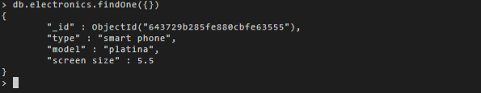
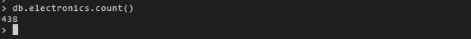

## Install `mongoimport` and `mongoexport` tools to move data in and out of the mongodb database

```shell
wget https://fastdl.mongodb.org/tools/db/mongodb-database-tools-ubuntu1804-x86_64-100.3.1.tgz
tar -xf mongodb-database-tools-ubuntu1804-x86_64-100.3.1.tgz
export PATH=$PATH:/home/project/mongodb-database-tools-ubuntu1804-x86_64-100.3.1/bin
echo "done"
```

## Import `catalog.json` into mongo db named `catalog` and collection named `electronics`

```shell
mongoimport -u root -p <password> --authenticationDatabase admin --db catalog --collection electronics --file catalog.json
```

## MongoDB record



## Count number of rows



## Export fields `__id`,` type`,` model `into electronics.csv

```shell
mongoexport -u root -p <password> --authenticationDatabase admin --db catalog --collection electronics --out electronics.csv --type=csv --fields _id,type,model
```
