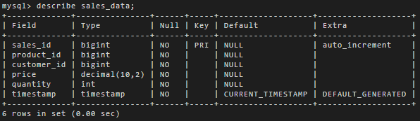
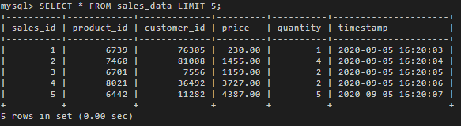
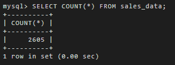

## Project #1

Develop an OLTP database that can handle business transactions.

## Objectives

- Design the schema

- Load data into OLTP database

## Project dependencies

- MySQL 8.0.22 / phpMyAdmin 5.0.4

## Steps

### Connect to MySQL via CLI

```
mysql --host=<host> --port=3306 --user=<user> --password=<password>
```

### Create database

```
CREATE DATABASE capstone_database;
```

### Create table sales_data on MySQL CLI

[create_table.sql](../sql/create_table.sql) is within the `sql/` directory

```
mysql --host=<host> --port=3306 --user=<user> --password=<password> < create_table.sql
```

### Import CSV file into `sales_data` table

- Connect to MySQL with CLI

- USE `capstone_database`

- Execute:
  
  ```
  LOAD DATA INFILE '/home/project/oltpdata.csv'
  INTO TABLE sales_data
  FIELDS TERMINATED BY ','
  ENCLOSED BY '"' LINES
  TERMINATED BY '\n'
  (product_id, customer_id, price, quantity, timestamp);
  ```

### Create Index on timestamp column

```
CREATE INDEX ts_index ON sales_data(timestamp);
```

### Describe `sales_data` table



### Select table



### Number of records inserted

